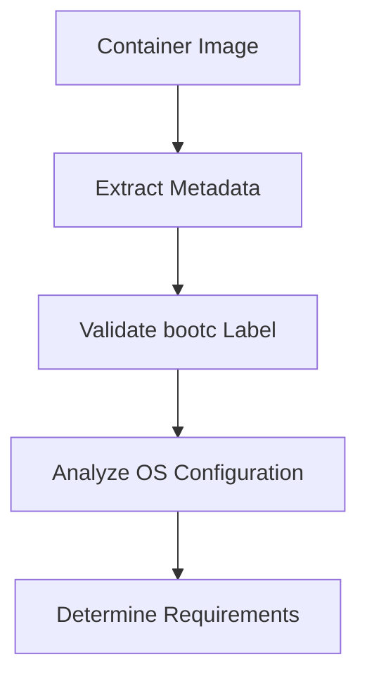
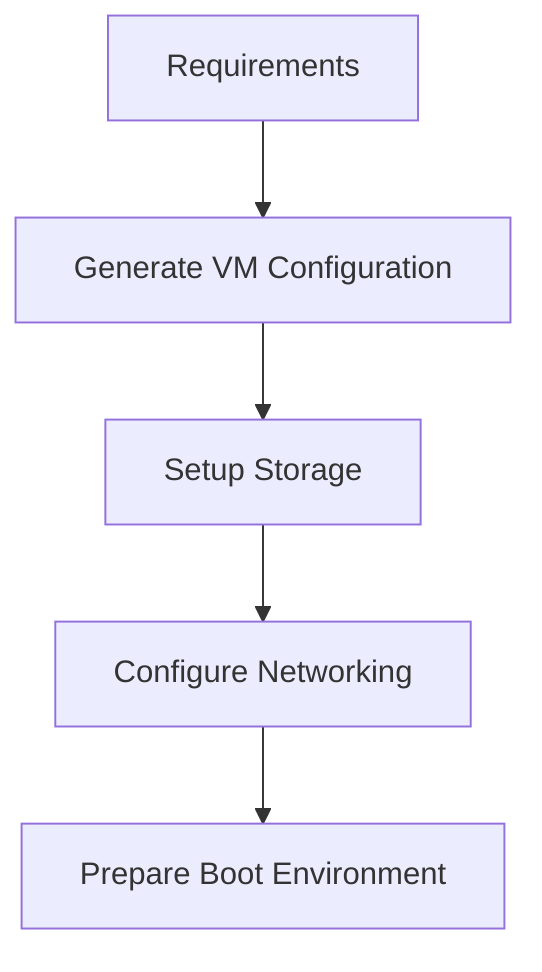
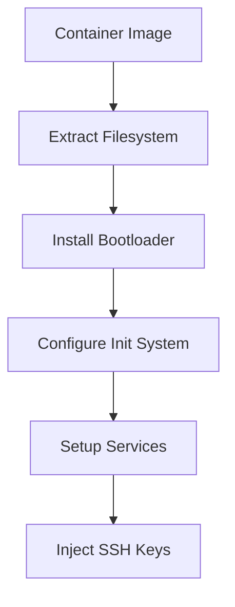
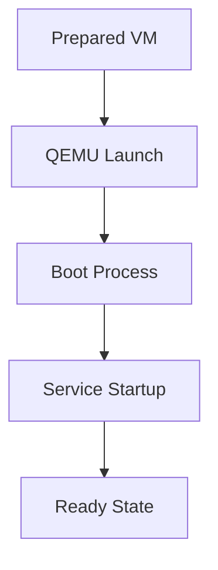
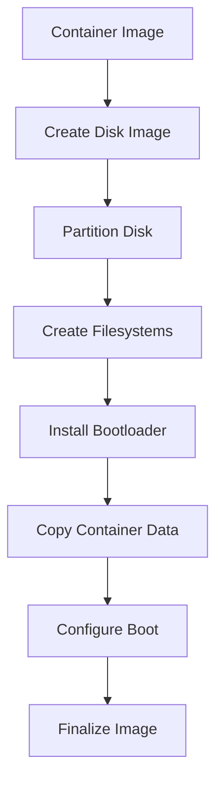
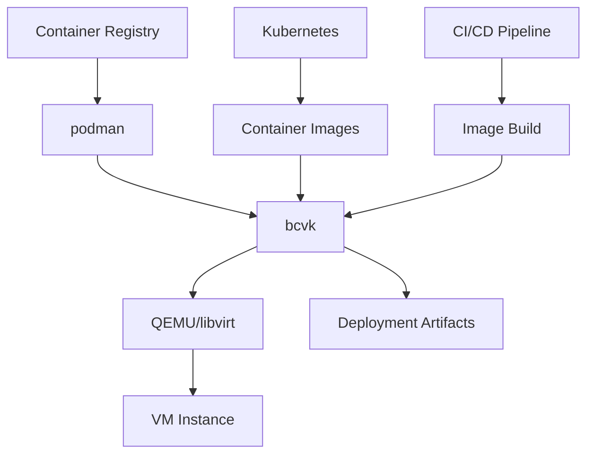
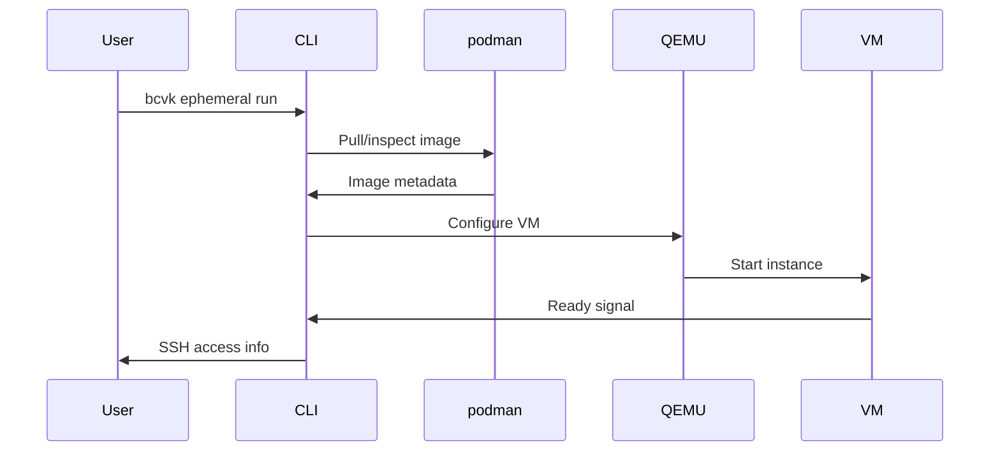
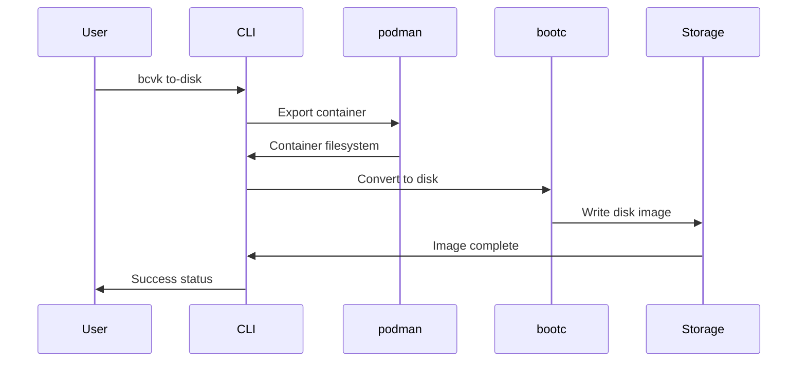

# Technical Architecture

This document provides a technical overview of bcvk's architecture, explaining how it converts bootc containers into virtual machines and disk images.

## Overview

bcvk bridges the gap between container technology and virtualization by providing seamless conversion from bootc container images to bootable virtual machines and disk images. The architecture is designed around modularity, security, and performance.

## Core Components

### Command-Line Interface (CLI)
The `bcvk` command provides a unified interface for all bcvk operations:
- **Ephemeral VMs**: `bcvk ephemeral run|ssh`
- **Disk Image Creation**: `bcvk to-disk`
- **Image Management**: `bcvk images`
- **libvirt Integration**: `bcvk libvirt run|start|stop|ssh|rm`

### Container Runtime Integration
bcvk leverages existing container runtimes for image management:
- **podman**: Primary container runtime for rootless operations
- **Container registries**: Support for local and remote image sources
- **Image inspection**: Automatic detection of bootc-compatible images

### Virtualization Backends
Multiple virtualization technologies are supported:
- **QEMU/KVM**: Primary virtualization platform
- **libvirt**: Advanced VM management and enterprise features
- **virtiofsd**: Filesystem sharing between host and VMs

### Storage Management
Flexible storage backends and formats:
- **Disk formats**: Raw, QCOW2, VHD, VMDK
- **Filesystems**: ext4, XFS, Btrfs
- **Storage pools**: libvirt storage pool integration

## Container to VM Conversion Process

### Phase 1: Image Analysis

1. **Image Identification**: Verify the `containers.bootc=1` label
2. **Metadata Extraction**: Parse image configuration, labels, and environment
3. **OS Detection**: Identify the base operating system and version
4. **Requirement Analysis**: Determine resource needs and boot requirements

### Phase 2: VM Environment Preparation

1. **Resource Allocation**: CPU, memory, and disk sizing
2. **Storage Setup**: Virtual disk creation and formatting
3. **Network Configuration**: Virtual networking and port forwarding
4. **Boot Preparation**: Bootloader and kernel parameter configuration

### Phase 3: Container Integration

1. **Filesystem Extraction**: Export container layers to VM filesystem
2. **Bootloader Installation**: Install and configure GRUB2 or systemd-boot
3. **Init System Setup**: Configure systemd or other init systems
4. **Service Configuration**: Enable and configure system services
5. **SSH Setup**: Inject public keys and configure SSH access

### Phase 4: VM Instantiation

1. **QEMU Configuration**: Generate QEMU command line with optimal settings
2. **VM Boot**: Start virtual machine with configured parameters
3. **Service Initialization**: System services start according to container configuration
4. **Ready Signal**: VM reaches operational state for user access

## Disk Image Creation Architecture

### Disk Image Pipeline

1. **Image Initialization**: Create empty disk image with specified size and format
2. **Partitioning**: Create GPT or MBR partition table with boot and root partitions
3. **Filesystem Creation**: Format partitions with selected filesystem (ext4, XFS, Btrfs)
4. **Bootloader Installation**: Install and configure bootloader for target platform
5. **Data Transfer**: Copy container filesystem contents to root partition
6. **Boot Configuration**: Configure kernel parameters and init system
7. **Image Finalization**: Optimize and compress image for deployment

### Format-Specific Processing
Different output formats require specialized handling:

#### Raw Images
- Direct byte-for-byte disk representation
- No compression or optimization
- Maximum compatibility across platforms

#### QCOW2 Images
- Copy-on-write format with compression
- Sparse allocation for efficient storage
- Snapshot and backing file support

#### Cloud Formats (VHD, VMDK)
- Platform-specific optimizations
- Cloud-init integration
- Hardware compatibility layers

## Security Architecture

### Privilege Separation
bcvk operates with minimal privileges:
- **Rootless containers**: Use podman's rootless mode when possible
- **User namespaces**: Isolate container operations
- **Minimal QEMU privileges**: Run VMs with least required privileges

### Container Security Model
Security inherits from container best practices:
- **Image verification**: Validate container signatures when available
- **Label-based access**: Respect container security labels
- **Network isolation**: Inherit container network security policies

### VM Security Features
Additional security for VM environments:
- **SSH key injection**: Automatic secure SSH configuration
- **Firewall integration**: Respect host firewall rules
- **SELinux/AppArmor**: Leverage host mandatory access controls

## Performance Architecture

### Resource Optimization
bcvk optimizes resource usage through:
- **Lazy loading**: Start VMs only when needed
- **Shared storage**: Reuse base images across VMs
- **Memory management**: Efficient memory allocation and ballooning

### Disk I/O Optimization
Multiple strategies for disk performance:
- **Virtio drivers**: High-performance paravirtualized I/O
- **Cache policies**: Configurable caching for different workloads
- **Storage backends**: Support for various storage technologies

### Network Performance
Network optimization techniques:
- **Virtio networking**: High-performance network drivers
- **Bridge networking**: Direct network access when appropriate
- **Multi-queue**: Parallel network processing

## Integration Architecture

### Container Runtime Integration
Deep integration with container ecosystems:

### Virtualization Platform Integration
Support for multiple virtualization platforms:
- **libvirt**: Enterprise VM management
- **QEMU direct**: Lightweight VM operation
- **Cloud platforms**: AWS, Azure, GCP integration
- **VMware**: vSphere and Workstation support

### Development Tool Integration
Integration with development workflows:
- **IDE support**: Remote development capabilities
- **Debugging tools**: GDB, profiling integration
- **CI/CD**: Automated testing and deployment

## Data Flow Architecture

### Ephemeral VM Data Flow

### Disk Image Creation Data Flow

## Error Handling and Recovery

### Graceful Degradation
bcvk implements multiple fallback strategies:
- **Alternative virtualization**: Fall back from KVM to emulation
- **Storage backends**: Try different storage options if primary fails
- **Network configuration**: Automatic network setup with fallbacks

### Error Recovery
Comprehensive error handling:
- **Cleanup on failure**: Automatic resource cleanup
- **Partial recovery**: Resume operations from checkpoints
- **Diagnostic information**: Detailed error reporting

### Logging and Monitoring
Observability features:
- **Structured logging**: Machine-readable log output
- **Performance metrics**: Resource usage tracking
- **Debug modes**: Verbose operation modes for troubleshooting

## Extensibility Architecture

### Plugin System
bcvk is designed for extensibility:
- **Storage backends**: Pluggable storage implementations
- **Virtualization targets**: Support for new VM platforms
- **Image formats**: Extensible format support

### API Design
Clean interfaces for integration:
- **Command-line API**: Stable CLI interface
- **Library interfaces**: Programmatic access to functionality
- **Configuration files**: Declarative configuration support

## Future Architecture Considerations

### Scalability Improvements
Planned architectural enhancements:
- **Parallel processing**: Concurrent VM operations
- **Resource pooling**: Shared resource management
- **Distributed operations**: Multi-host coordination

### Advanced Features
Future architectural directions:
- **Live migration**: VM mobility between hosts
- **Snapshot management**: Advanced state management
- **Container orchestration**: Kubernetes integration

### Performance Optimizations
Ongoing performance work:
- **Zero-copy operations**: Minimize data copying
- **Hardware acceleration**: GPU and specialized hardware support
- **Memory optimization**: Advanced memory management techniques

## Comparison with Alternatives

### vs. Traditional VM Creation
bcvk advantages:
- **Container-native**: Leverages existing container workflows
- **Automation**: Eliminates manual VM configuration
- **Consistency**: Reproducible VM creation from containers

### vs. Container-only Deployment
bcvk benefits:
- **Full OS environment**: Complete system capabilities
- **Hardware access**: Direct hardware interaction
- **Isolation**: Strong process and resource isolation

### vs. Manual bootc Tools
bcvk improvements:
- **Integrated workflow**: Single tool for multiple operations
- **User-friendly**: Simplified command-line interface
- **Automation**: Automated SSH setup and networking

This architecture enables bcvk to provide a seamless bridge between container and virtualization technologies while maintaining security, performance, and ease of use.