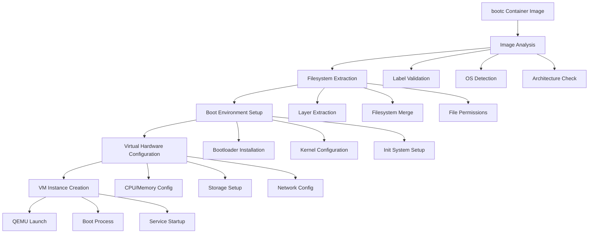

# Container to VM Conversion

This document explains how bcvk converts bootc container images into virtual machines, covering the technical details of the transformation process.

## Overview

Container to VM conversion is the core functionality of bcvk, enabling bootc container images to run as full virtual machines. This process involves extracting the container filesystem, configuring a bootable environment, and creating a VM that behaves like a traditional operating system installation.

## The bootc Container Model

### What Makes a bootc Container Special

bootc containers differ from application containers in several key ways:

```dockerfile
# Traditional application container
FROM fedora:39
RUN dnf install -y httpd
COPY app/ /var/www/html/
CMD ["httpd", "-D", "FOREGROUND"]

# bootc container
FROM quay.io/fedora/fedora-bootc:42
LABEL containers.bootc=1

# Install system packages
RUN dnf install -y httpd mysql-server

# Configure system services
RUN systemctl enable httpd mysql

# System configuration
COPY systemd-units/ /etc/systemd/system/
COPY sysctl-config/ /etc/sysctl.d/

# No CMD - boots like a full OS
```

### bootc Container Requirements

For successful VM conversion, bootc containers must:

1. **Have the bootc label**: `containers.bootc=1`
2. **Include a complete OS**: Full system with kernel, init system
3. **Be bootable**: Configured to boot and run as an OS
4. **Include systemd**: Or another compatible init system
5. **Have proper filesystem layout**: Standard Unix filesystem hierarchy

## Conversion Process Overview



## Phase 1: Image Analysis

### Container Image Validation

```rust
// Pseudo-code for image validation
fn validate_bootc_image(image: &ContainerImage) -> Result<()> {
    // Check for bootc label
    let labels = image.get_labels()?;
    if labels.get("containers.bootc") != Some("1") {
        return Err("Image is not marked as bootc-compatible");
    }
    
    // Verify OS components
    let filesystem = image.get_filesystem()?;
    
    // Check for essential directories
    for required_dir in ["/usr", "/etc", "/var", "/boot"] {
        if !filesystem.exists(required_dir) {
            return Err(format!("Missing required directory: {}", required_dir));
        }
    }
    
    // Check for init system
    if !filesystem.exists("/usr/lib/systemd/systemd") {
        return Err("No systemd found in image");
    }
    
    // Verify kernel presence
    if !filesystem.glob("/boot/vmlinuz-*").any() {
        return Err("No kernel found in image");
    }
    
    Ok(())
}
```

### Metadata Extraction

Key information extracted from the container:

```yaml
# Container metadata extracted
image_info:
  architecture: x86_64
  os: linux
  os_version: fedora-42
  bootc_version: "1.0"
  
filesystem_info:
  root_size: 2.1GB
  kernel_version: 6.5.0-301.fc42.x86_64
  init_system: systemd
  
services:
  enabled:
    - sshd
    - firewalld
    - chronyd
  disabled:
    - NetworkManager
  
packages:
  - kernel-6.5.0-301.fc42
  - systemd-254
  - openssh-server-9.3
```

## Phase 2: Filesystem Extraction and Preparation

### Container Layer Processing

```bash
# Simplified view of layer extraction process
podman export container-id | tar -xf - -C /tmp/vm-root/

# Or using containers/image library
skopeo copy containers-storage:image-id dir:/tmp/extracted-image
```

### Filesystem Hierarchy Preparation

The extracted filesystem is prepared for VM boot:

```bash
# Example filesystem preparation
/tmp/vm-root/
├── boot/                 # Bootloader and kernel files
│   ├── vmlinuz-6.5.0*   # Kernel image
│   ├── initramfs-6.5.0* # Initial ramdisk
│   └── grub2/           # Bootloader configuration
├── etc/                 # System configuration
│   ├── fstab           # Filesystem table
│   ├── systemd/        # Service configurations
│   └── ssh/            # SSH configuration
├── usr/                 # System binaries and libraries
├── var/                 # Variable data
└── root/               # Root user home
```

### File System Modifications

Several modifications are made to adapt the container for VM use:

#### 1. Filesystem Table (fstab)
```bash
# Generated /etc/fstab
UUID=12345678-1234-1234-1234-123456789abc / ext4 defaults 1 1
UUID=87654321-4321-4321-4321-cba987654321 /boot ext4 defaults 1 2
```

#### 2. Network Configuration
```bash
# Network interface configuration
cat > /etc/systemd/network/10-eth0.network <<EOF
[Match]
Name=eth0

[Network]
DHCP=yes
EOF
```

#### 3. SSH Key Injection
```bash
# SSH key injection for VM access
mkdir -p /root/.ssh
echo "$SSH_PUBLIC_KEY" > /root/.ssh/authorized_keys
chmod 600 /root/.ssh/authorized_keys
chmod 700 /root/.ssh
```

## Phase 3: Boot Environment Setup

### Bootloader Installation

#### GRUB2 Configuration
```bash
# Install GRUB2 bootloader
grub2-install --target=i386-pc --boot-directory=/tmp/vm-root/boot /dev/loop0

# Generate GRUB configuration
cat > /tmp/vm-root/boot/grub2/grub.cfg <<EOF
set timeout=5
set default=0

menuentry "bootc VM" {
    linux /boot/vmlinuz-6.5.0-301.fc42.x86_64 root=UUID=12345... ro quiet
    initrd /boot/initramfs-6.5.0-301.fc42.x86_64.img
}
EOF
```

#### systemd-boot (Alternative)
```bash
# For UEFI systems using systemd-boot
bootctl install --path=/tmp/vm-root/boot

cat > /tmp/vm-root/boot/loader/entries/bootc.conf <<EOF
title   bootc VM
linux   /vmlinuz-6.5.0-301.fc42.x86_64
initrd  /initramfs-6.5.0-301.fc42.x86_64.img
options root=UUID=12345... ro quiet
EOF
```

### Kernel and Initramfs Handling

The conversion process ensures the kernel and initramfs are properly configured:

```bash
# Verify kernel modules
ls /tmp/vm-root/lib/modules/6.5.0-301.fc42.x86_64/

# Check initramfs contents
lsinitrd /tmp/vm-root/boot/initramfs-6.5.0-301.fc42.x86_64.img

# Regenerate initramfs if needed (in chroot)
chroot /tmp/vm-root dracut --force /boot/initramfs-6.5.0-301.fc42.x86_64.img
```

## Phase 4: Virtual Disk Creation

### Disk Image Creation Process

```rust
// Pseudo-code for disk creation
fn create_vm_disk(filesystem_root: &Path, output: &Path, size: u64) -> Result<()> {
    // Create empty disk image
    let disk = create_disk_image(output, size)?;
    
    // Create partition table
    create_partition_table(&disk, PartitionScheme::GPT)?;
    
    // Create partitions
    let boot_partition = create_partition(&disk, 512_MB, PartitionType::EFI)?;
    let root_partition = create_partition(&disk, size - 512_MB, PartitionType::Linux)?;
    
    // Format filesystems
    format_filesystem(&boot_partition, FilesystemType::FAT32)?;
    format_filesystem(&root_partition, FilesystemType::Ext4)?;
    
    // Mount and copy data
    let mount_point = mount_disk(&disk)?;
    copy_filesystem_tree(filesystem_root, &mount_point)?;
    
    // Install bootloader
    install_bootloader(&mount_point, &boot_partition)?;
    
    unmount_disk(&mount_point)?;
    Ok(())
}
```

### Partition Layout

Standard partition layout for bootc VMs:

```
Disk: /dev/vda (20GB)
├── /dev/vda1 (512MB, EFI System Partition)
│   └── FAT32 filesystem, mounted at /boot/efi
└── /dev/vda2 (19.5GB, Linux filesystem)
    └── ext4 filesystem, mounted at /
```

For BIOS systems:
```
Disk: /dev/vda (20GB)
├── BIOS Boot Partition (1MB)
└── /dev/vda1 (19.99GB, Linux filesystem)
    └── ext4 filesystem, mounted at /
```

## Phase 5: VM Configuration Generation

### QEMU Configuration

The VM configuration is generated based on the container requirements:

```bash
# Example QEMU command line generated
qemu-system-x86_64 \
  -machine type=q35,accel=kvm \
  -cpu host \
  -smp 2 \
  -m 2048 \
  -drive file=/path/to/vm-disk.qcow2,format=qcow2,if=virtio \
  -netdev user,id=net0,hostfwd=tcp::2222-:22 \
  -device virtio-net-pci,netdev=net0 \
  -device virtio-rng-pci \
  -display none \
  -serial stdio
```

### libvirt Domain XML

For libvirt integration, a domain XML is generated:

```xml
<domain type='kvm'>
  <name>bootc-vm</name>
  <memory unit='KiB'>2097152</memory>
  <vcpu placement='static'>2</vcpu>
  
  <os>
    <type arch='x86_64' machine='pc-q35-8.1'>hvm</type>
    <boot dev='hd'/>
  </os>
  
  <features>
    <acpi/>
    <apic/>
    <vmport state='off'/>
  </features>
  
  <cpu mode='host-model' check='partial'/>
  
  <devices>
    <disk type='file' device='disk'>
      <driver name='qemu' type='qcow2'/>
      <source file='/var/lib/libvirt/images/bootc-vm.qcow2'/>
      <target dev='vda' bus='virtio'/>
    </disk>
    
    <interface type='network'>
      <source network='default'/>
      <model type='virtio'/>
    </interface>
    
    <console type='pty'>
      <target type='serial' port='0'/>
    </console>
  </devices>
</domain>
```

## Boot Process in the VM

### VM Boot Sequence

1. **BIOS/UEFI**: Hardware initialization
2. **Bootloader**: GRUB2 or systemd-boot loads kernel
3. **Kernel**: Linux kernel starts with initramfs
4. **Init**: systemd takes over as PID 1
5. **Services**: System services start according to container configuration

### Service Activation

The VM boots with the same services that were enabled in the container:

```bash
# Services from container are preserved
systemctl list-unit-files --state=enabled

# Output shows services from original container:
# sshd.service             enabled
# firewalld.service        enabled  
# httpd.service            enabled
# mysqld.service           enabled
```

## Differences from Container Runtime

### Process Model

| Aspect | Container | VM |
|--------|-----------|-----|
| PID 1 | Application or shell | systemd |
| Init System | Minimal or none | Full systemd |
| Service Management | External orchestrator | Internal systemd |
| Process Isolation | Namespaces | Hardware virtualization |
| Resource Limits | cgroups | Virtual hardware |

### Filesystem Model

```bash
# Container filesystem (overlay)
/var/lib/containers/storage/overlay/abc123.../merged/

# VM filesystem (real disk)
/dev/vda2 mounted at /
```

### Network Model

```bash
# Container networking (bridge/host)
Container -> Host network namespace -> Physical network

# VM networking (virtualized)
VM -> Virtual network interface -> Host bridge -> Physical network
```

## Performance Considerations

### Conversion Performance

Factors affecting conversion speed:

1. **Container size**: Larger containers take longer to extract
2. **Disk I/O**: Fast storage improves conversion time
3. **Compression**: Image compression affects extraction speed
4. **Memory**: Available RAM for temporary filesystem operations

### Runtime Performance

VM performance compared to containers:

```
Benchmark Results (relative to container):
- CPU Performance: ~95% (minimal overhead)
- Memory Performance: ~90% (virtualization overhead)
- I/O Performance: ~85% (virtio drivers)
- Network Performance: ~90% (virtio networking)
- Boot Time: +15-30 seconds (full OS boot)
```

## Optimization Techniques

### Layer Optimization

```rust
// Optimize container layers for VM conversion
fn optimize_layers(layers: &[ContainerLayer]) -> Vec<ContainerLayer> {
    layers
        .iter()
        .filter(|layer| !layer.is_empty())
        .filter(|layer| !layer.contains_only_metadata())
        .cloned()
        .collect()
}
```

### Filesystem Optimization

```bash
# Optimize filesystem for VM use
# Remove container-specific files
rm -rf /tmp/vm-root/.dockerenv
rm -rf /tmp/vm-root/etc/resolv.conf.original

# Optimize for VM storage
# Enable filesystem compression if supported
tune2fs -o journal_data_writeback /dev/vda2

# Configure appropriate mount options in fstab
echo "UUID=... / ext4 defaults,noatime,commit=60 0 1" > /etc/fstab
```

## Error Handling and Recovery

### Common Conversion Issues

1. **Missing bootc label**: Image not compatible
2. **No kernel found**: Incomplete system image
3. **Init system missing**: No systemd or compatible init
4. **Architecture mismatch**: Container and host architecture differ
5. **Filesystem corruption**: Damaged container layers

### Recovery Strategies

```rust
// Error recovery during conversion
match conversion_error {
    MissingBootcLabel => {
        warn!("Image may not be bootc-compatible, proceeding anyway");
        // Continue with best-effort conversion
    },
    
    MissingKernel => {
        error!("No kernel found, cannot create bootable VM");
        return Err("Conversion failed: missing kernel");
    },
    
    FilesystemError(e) => {
        warn!("Filesystem issue detected: {}", e);
        // Attempt filesystem repair
        if repair_filesystem().is_ok() {
            // Retry conversion
            retry_conversion()?;
        }
    },
}
```

## Integration Points

### Container Runtime Integration

bcvk integrates with container runtimes to access images:

```rust
// Integration with podman
let image = podman::get_image("quay.io/fedora/fedora-bootc:42")?;
let filesystem = image.export_filesystem()?;

// Integration with containerd (future)
let image = containerd::pull_image("quay.io/fedora/fedora-bootc:42")?;
let snapshot = image.create_snapshot()?;
```

### Virtualization Platform Integration

Support for multiple virtualization backends:

```rust
// QEMU direct integration
let vm = qemu::VirtualMachine::new()
    .disk(&disk_image)
    .memory(2048)
    .cpus(2)
    .create()?;

// libvirt integration
let domain = libvirt::Domain::define_xml(&domain_xml)?;
domain.start()?;
```

## Future Enhancements

### Planned Improvements

1. **Incremental conversion**: Convert only changed layers
2. **Parallel processing**: Multi-threaded filesystem operations
3. **Cloud-init integration**: Better cloud deployment support
4. **Container-native services**: Preserve container orchestration metadata
5. **Live conversion**: Convert running containers to VMs

### Advanced Features

```rust
// Future: Incremental conversion
struct IncrementalConverter {
    base_image: ImageId,
    layer_cache: LayerCache,
}

impl IncrementalConverter {
    fn convert_incremental(&self, new_image: &Image) -> Result<VmDisk> {
        let changed_layers = self.detect_changes(new_image)?;
        let updated_filesystem = self.apply_layer_changes(changed_layers)?;
        self.update_vm_disk(updated_filesystem)
    }
}
```

This conversion process enables seamless transition from container development workflows to full VM deployments, maintaining the benefits of both container portability and VM isolation.