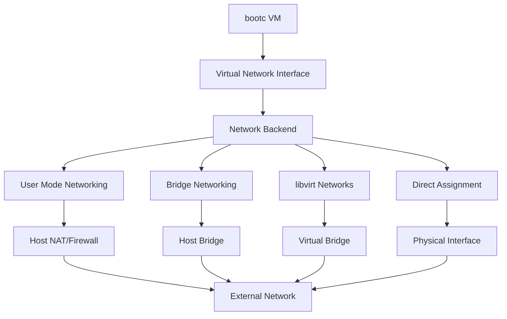

# Network Configuration

This guide covers network configuration options in bcvk, including basic networking, advanced configurations, security, and troubleshooting.

## Network Architecture Overview

bcvk supports multiple networking models to accommodate different use cases:



## Basic Network Configuration

### Default Networking

By default, VMs use user-mode networking with NAT:

```bash
# Default networking (NAT with dynamic ports)
bcvk ephemeral run quay.io/fedora/fedora-bootc:42

# Default libvirt networking
bcvk libvirt run quay.io/fedora/fedora-bootc:42
```

Default configuration provides:
- Outbound internet access
- Automatic IP assignment (DHCP)
- Isolation from host network
- No inbound access (unless port forwarding configured)

### Port Forwarding

Forward specific ports from host to VM:

```bash
# Single port forward
bcvk ephemeral run -p 8080:80 web-server-image
bcvk libvirt run --port 8080:80 web-server-image

# Multiple port forwards
bcvk libvirt run \
  --port 8080:80 \
  --port 8443:443 \
  --port 3306:3306 \
  full-stack-image

# SSH port forwarding
bcvk libvirt run --port 2222:22 dev-image
ssh -p 2222 user@localhost
```

### Network Interface Configuration

Configure network interfaces in VMs:

```bash
# Specify network for libvirt VMs
bcvk libvirt run --network default app-image
bcvk libvirt run --network bridge=br0 bridge-image
bcvk libvirt run --network isolated isolated-image

# Multiple network interfaces
bcvk libvirt run \
  --network default \
  --network bridge=br1 \
  --name multi-interface-vm \
  router-image
```

## Network Types

### User Mode Networking (Default for Ephemeral VMs)

User mode networking provides isolated, NAT-based connectivity:

```bash
# Explicit user mode networking
bcvk ephemeral run --network user quay.io/fedora/fedora-bootc:42

# With custom port forwards
bcvk ephemeral run \
  --network user \
  -p 8080:80 \
  -p 3306:3306 \
  web-app-image
```

**Characteristics:**
- No root privileges required
- Automatic NAT and DHCP
- VM gets IP in 10.0.2.0/24 range
- DNS forwarding from host
- Port forwarding for inbound access

### Bridge Networking

Bridge networking connects VMs directly to host network:

```bash
# Create bridge on host
sudo ip link add br0 type bridge
sudo ip link set br0 up
sudo ip link set eth0 master br0

# Use bridge with VM
bcvk libvirt run --network bridge=br0 bridged-vm

# Bridge with specific MAC address
bcvk libvirt run \
  --network bridge=br0 \
  --mac-address 52:54:00:12:34:56 \
  static-mac-vm
```

**Characteristics:**
- VMs appear as physical devices on network
- Can receive DHCP from network DHCP server
- Direct access to/from other network devices
- Higher performance than NAT
- Requires bridge configuration on host

### libvirt Virtual Networks

libvirt provides managed virtual networks:

```bash
# List available networks
virsh net-list --all

# Default libvirt network info
virsh net-info default

# Use specific libvirt network
bcvk libvirt run --network production app-image
```

#### Creating Custom libvirt Networks

```bash
# Create isolated network
virsh net-define - <<EOF
<network>
  <name>isolated-test</name>
  <bridge name='virbr10'/>
  <ip address='192.168.100.1' netmask='255.255.255.0'>
    <dhcp>
      <range start='192.168.100.10' end='192.168.100.100'/>
    </dhcp>
  </ip>
</network>
EOF

virsh net-start isolated-test
virsh net-autostart isolated-test

# Use custom network
bcvk libvirt run --network isolated-test test-vm
```

#### NAT Network with Custom Routing

```bash
# Create NAT network with custom subnet
virsh net-define - <<EOF
<network>
  <name>custom-nat</name>
  <forward mode='nat'>
    <nat>
      <port start='1024' end='65535'/>
    </nat>
  </forward>
  <bridge name='virbr11' stp='on' delay='0'/>
  <ip address='10.0.50.1' netmask='255.255.255.0'>
    <dhcp>
      <range start='10.0.50.10' end='10.0.50.100'/>
      <host mac='52:54:00:12:34:56' name='webserver' ip='10.0.50.10'/>
    </dhcp>
  </ip>
</network>
EOF

virsh net-start custom-nat
```

### Host-Only Networking

Create isolated networks for VM-to-VM communication:

```bash
# Create host-only network
virsh net-define - <<EOF
<network>
  <name>host-only</name>
  <bridge name='virbr20'/>
  <ip address='172.16.0.1' netmask='255.255.0.0'>
    <dhcp>
      <range start='172.16.0.10' end='172.16.255.254'/>
    </dhcp>
  </ip>
</network>
EOF

virsh net-start host-only
virsh net-autostart host-only

# VMs on host-only network
bcvk libvirt run --network host-only vm1
bcvk libvirt run --network host-only vm2
```

## Advanced Network Configurations

### Multi-Homed VMs

VMs with multiple network interfaces:

```bash
# VM with multiple networks
bcvk libvirt run \
  --name router-vm \
  --network external \
  --network internal \
  --network dmz \
  router-image

# Configure routing in VM
bcvk libvirt ssh router-vm "
  sudo sysctl -w net.ipv4.ip_forward=1
  sudo iptables -t nat -A POSTROUTING -o eth0 -j MASQUERADE
  sudo iptables -A FORWARD -i eth1 -o eth0 -j ACCEPT
  sudo iptables -A FORWARD -i eth0 -o eth1 -m state --state RELATED,ESTABLISHED -j ACCEPT
"
```

### VLAN Configuration

Configure VLAN networking:

```bash
# Create VLAN-aware bridge
sudo ip link add br0 type bridge vlan_filtering 1
sudo ip link set br0 up

# Add physical interface to bridge
sudo ip link set eth0 master br0
sudo bridge vlan add vid 100 dev eth0
sudo bridge vlan add vid 200 dev eth0

# Create VLAN networks in libvirt
virsh net-define - <<EOF
<network>
  <name>vlan100</name>
  <forward mode='bridge'/>
  <bridge name='br0'/>
  <vlan>
    <tag id='100'/>
  </vlan>
</network>
EOF

# Use VLAN network
bcvk libvirt run --network vlan100 vlan-vm
```

### SR-IOV and Hardware Passthrough

Direct hardware access for high performance:

```bash
# Enable SR-IOV on network interface
echo 4 | sudo tee /sys/class/net/eth0/device/sriov_numvfs

# Assign VF to VM
bcvk libvirt run \
  --name high-perf-vm \
  --network-device passthrough \
  --network-vf eth0-vf0 \
  performance-image

# Check VF assignment
lspci | grep Virtual
```

### Macvtap Networking

Direct connection to physical interface:

```bash
# Macvtap networking (bridge mode)
bcvk libvirt run \
  --network-type macvtap \
  --network-source eth0 \
  --network-mode bridge \
  direct-access-vm

# Macvtap with VEPA mode
bcvk libvirt run \
  --network-type macvtap \
  --network-source eth0 \
  --network-mode vepa \
  vepa-vm
```

## Network Security

### Firewall Configuration

#### Host Firewall Integration

```bash
# Configure host firewall for VM access
sudo firewall-cmd --permanent --add-port=8080/tcp
sudo firewall-cmd --permanent --add-port=8443/tcp
sudo firewall-cmd --reload

# Create firewall zone for VMs
sudo firewall-cmd --permanent --new-zone=vm-zone
sudo firewall-cmd --permanent --zone=vm-zone --add-source=192.168.122.0/24
sudo firewall-cmd --permanent --zone=vm-zone --add-service=ssh
sudo firewall-cmd --permanent --zone=vm-zone --add-service=http
sudo firewall-cmd --reload
```

#### VM-Level Firewall

```bash
# Configure firewall inside VM
bcvk libvirt ssh webapp "
  sudo firewall-cmd --permanent --add-service=http
  sudo firewall-cmd --permanent --add-service=https
  sudo firewall-cmd --permanent --add-port=8080/tcp
  sudo firewall-cmd --reload
"

# Restrict SSH access
bcvk libvirt ssh secure-vm "
  sudo firewall-cmd --permanent --remove-service=ssh
  sudo firewall-cmd --permanent --add-rich-rule='rule family=ipv4 source address=192.168.1.100 service name=ssh accept'
  sudo firewall-cmd --reload
"
```

### Network Isolation

#### libvirt Network Filters

```bash
# Apply network filter to VM
virsh define - <<EOF
<domain type='kvm'>
  <name>filtered-vm</name>
  <interface type='network'>
    <source network='default'/>
    <filterref filter='clean-traffic'/>
  </interface>
</domain>
EOF

# Custom network filter
virsh nwfilter-define - <<EOF
<filter name='custom-filter' chain='root'>
  <rule action='accept' direction='out' priority='100'>
    <tcp dstportstart='80'/>
  </rule>
  <rule action='accept' direction='out' priority='100'>
    <tcp dstportstart='443'/>
  </rule>
  <rule action='accept' direction='out' priority='100'>
    <tcp dstportstart='53'/>
  </rule>
  <rule action='accept' direction='out' priority='100'>
    <udp dstportstart='53'/>
  </rule>
  <rule action='drop' direction='out' priority='1000'/>
</filter>
EOF
```

#### Network Segmentation

```bash
# Create segmented networks for different tiers
# Frontend network
virsh net-define - <<EOF
<network>
  <name>frontend</name>
  <bridge name='virbr-frontend'/>
  <ip address='10.0.1.1' netmask='255.255.255.0'>
    <dhcp>
      <range start='10.0.1.10' end='10.0.1.100'/>
    </dhcp>
  </ip>
</network>
EOF

# Backend network
virsh net-define - <<EOF
<network>
  <name>backend</name>
  <bridge name='virbr-backend'/>
  <ip address='10.0.2.1' netmask='255.255.255.0'>
    <dhcp>
      <range start='10.0.2.10' end='10.0.2.100'/>
    </dhcp>
  </ip>
</network>
EOF

# Deploy segmented application
bcvk libvirt run --network frontend web-frontend
bcvk libvirt run --network frontend --network backend app-server
bcvk libvirt run --network backend database-server
```

### VPN and Tunneling

#### OpenVPN Server VM

```bash
# Deploy OpenVPN server
bcvk libvirt run \
  --name vpn-server \
  --network external \
  --port 1194:1194/udp \
  --volume /etc/openvpn:/etc/openvpn \
  openvpn-server-image

# Configure OpenVPN
bcvk libvirt ssh vpn-server "
  sudo openvpn --genkey --secret /etc/openvpn/static.key
  sudo systemctl enable openvpn@server
  sudo systemctl start openvpn@server
"
```

#### WireGuard VPN

```bash
# WireGuard server VM
bcvk libvirt run \
  --name wireguard-server \
  --network external \
  --port 51820:51820/udp \
  wireguard-image

# Generate WireGuard keys
bcvk libvirt ssh wireguard-server "
  wg genkey | tee /etc/wireguard/privatekey | wg pubkey > /etc/wireguard/publickey
"
```

## Network Performance Optimization

### High-Performance Networking

#### Virtio Networking

```bash
# Use virtio for best performance (default in modern setups)
bcvk libvirt run \
  --network-model virtio \
  --network-queue-size 1024 \
  high-throughput-app

# Multi-queue virtio
bcvk libvirt run \
  --network-model virtio \
  --network-queues 4 \
  --cpus 4 \
  parallel-network-app
```

#### Network Buffer Tuning

```bash
# Tune network buffers in VM
bcvk libvirt ssh performance-vm "
  # Increase network buffer sizes
  echo 'net.core.rmem_max = 16777216' | sudo tee -a /etc/sysctl.conf
  echo 'net.core.wmem_max = 16777216' | sudo tee -a /etc/sysctl.conf
  echo 'net.ipv4.tcp_rmem = 4096 87380 16777216' | sudo tee -a /etc/sysctl.conf
  echo 'net.ipv4.tcp_wmem = 4096 65536 16777216' | sudo tee -a /etc/sysctl.conf
  
  # Apply changes
  sudo sysctl -p
"
```

#### DPDK and User-Space Networking

```bash
# VM with DPDK support
bcvk libvirt run \
  --name dpdk-vm \
  --memory 8192 \
  --hugepages \
  --network-type vhost-user \
  --network-backend dpdk \
  dpdk-app-image
```

### Network Monitoring and Optimization

#### Bandwidth Monitoring

```bash
# Monitor network usage
bcvk libvirt ssh vmname "
  # Install monitoring tools
  sudo dnf install -y iftop nethogs

  # Monitor interface traffic
  sudo iftop -i eth0
  
  # Monitor per-process network usage
  sudo nethogs eth0
"

# Host-level monitoring
iftop -i virbr0
vnstat -i virbr0
```

#### Performance Testing

```bash
# Network performance testing between VMs
# Server VM
bcvk libvirt ssh server-vm "iperf3 -s"

# Client VM
bcvk libvirt ssh client-vm "iperf3 -c server-vm-ip -t 60"

# Latency testing
bcvk libvirt ssh client-vm "ping -c 100 server-vm-ip"

# UDP performance
bcvk libvirt ssh client-vm "iperf3 -c server-vm-ip -u -b 1G"
```

## Network Troubleshooting

### Common Network Issues

#### Connectivity Problems

```bash
# Check VM network configuration
bcvk libvirt ssh vmname "
  ip addr show
  ip route show
  cat /etc/resolv.conf
"

# Test connectivity
bcvk libvirt ssh vmname "
  ping -c 3 8.8.8.8
  curl -I http://google.com
  nslookup google.com
"

# Check host networking
ip addr show
ip route show
systemctl status NetworkManager
```

#### Port Forwarding Issues

```bash
# Check if port forwarding is working
netstat -tlnp | grep :8080

# Test port accessibility
telnet localhost 8080

# Check firewall rules
sudo iptables -L -n -v
sudo firewall-cmd --list-all
```

#### DNS Resolution Problems

```bash
# Check DNS in VM
bcvk libvirt ssh vmname "
  cat /etc/resolv.conf
  nslookup google.com
  dig @8.8.8.8 google.com
"

# Fix DNS in VM
bcvk libvirt ssh vmname "
  echo 'nameserver 8.8.8.8' | sudo tee /etc/resolv.conf
  sudo systemctl restart NetworkManager
"
```

### Network Debugging Tools

#### Packet Capture

```bash
# Capture packets on host
sudo tcpdump -i virbr0 -w vm-traffic.pcap

# Capture in VM
bcvk libvirt ssh vmname "
  sudo tcpdump -i eth0 -w /tmp/vm-capture.pcap
"

# Analyze with Wireshark
wireshark vm-traffic.pcap
```

#### Network Analysis

```bash
# Check network statistics
bcvk libvirt ssh vmname "
  ss -tuln
  netstat -i
  cat /proc/net/dev
"

# Monitor real-time connections
bcvk libvirt ssh vmname "
  watch -n 1 'ss -tuln | grep :80'
"
```

#### libvirt Network Debugging

```bash
# Check libvirt network status
virsh net-list --all
virsh net-info default

# Check network bridge
brctl show virbr0
ip link show virbr0

# Monitor libvirt network events
virsh event --all --loop | grep network
```

## Network Automation

### Automated Network Configuration

```bash
#!/bin/bash
# Network setup automation script

# Create application networks
create_app_networks() {
    # Frontend network
    virsh net-define - <<EOF
<network>
  <name>app-frontend</name>
  <bridge name='virbr-frontend'/>
  <ip address='10.0.10.1' netmask='255.255.255.0'>
    <dhcp>
      <range start='10.0.10.10' end='10.0.10.100'/>
    </dhcp>
  </ip>
</network>
EOF

    # Backend network
    virsh net-define - <<EOF
<network>
  <name>app-backend</name>
  <bridge name='virbr-backend'/>
  <ip address='10.0.20.1' netmask='255.255.255.0'>
    <dhcp>
      <range start='10.0.20.10' end='10.0.20.100'/>
    </dhcp>
  </ip>
</network>
EOF

    # Start networks
    virsh net-start app-frontend
    virsh net-start app-backend
    virsh net-autostart app-frontend
    virsh net-autostart app-backend
}

# Deploy multi-tier application
deploy_app() {
    # Load balancer
    bcvk libvirt run \
      --name app-lb \
      --network default \
      --network app-frontend \
      --port 80:80 \
      --port 443:443 \
      loadbalancer-image

    # Web servers
    for i in {1..2}; do
        bcvk libvirt run \
          --name app-web-$i \
          --network app-frontend \
          --network app-backend \
          webserver-image
    done

    # Database
    bcvk libvirt run \
      --name app-db \
      --network app-backend \
      --disk-size 50G \
      database-image
}

create_app_networks
deploy_app
```

### Infrastructure as Code

#### Terraform Network Configuration

```hcl
# Network configuration with Terraform
resource "libvirt_network" "app_network" {
  name      = "app-network"
  mode      = "nat"
  domain    = "app.local"
  addresses = ["10.0.100.0/24"]
  
  dhcp {
    enabled = true
  }
  
  dns {
    enabled    = true
    local_only = false
  }
}

resource "libvirt_network" "db_network" {
  name      = "db-network"
  mode      = "none"
  addresses = ["10.0.200.0/24"]
  
  dhcp {
    enabled = true
  }
}

module "web_servers" {
  source = "./modules/bootc-vm"
  count  = 2
  
  name     = "web-${count.index + 1}"
  image    = "quay.io/company/webapp:latest"
  networks = [
    libvirt_network.app_network.name,
    libvirt_network.db_network.name
  ]
}
```

## Best Practices

### Network Design

1. **Segmentation**: Isolate different application tiers
2. **Security**: Apply appropriate firewall rules and filters
3. **Performance**: Use virtio drivers and appropriate queue settings
4. **Monitoring**: Implement network monitoring and alerting
5. **Documentation**: Document network topology and configurations

### Security Best Practices

1. **Minimal Exposure**: Only expose necessary ports
2. **Network Isolation**: Use separate networks for different security zones
3. **Firewall Rules**: Implement defense-in-depth with multiple firewall layers
4. **Access Control**: Limit administrative network access
5. **Encryption**: Use VPNs or encrypted protocols for sensitive traffic

### Performance Best Practices

1. **Interface Selection**: Use virtio for best performance
2. **Queue Configuration**: Enable multi-queue for high-throughput applications
3. **Buffer Tuning**: Optimize network buffers for workload
4. **Monitoring**: Regular performance monitoring and optimization
5. **Hardware**: Use SR-IOV for highest performance requirements

## Next Steps

- Explore [libvirt advanced workflows](./libvirt-advanced.md) for complex networking scenarios
- Learn about [storage management](./storage-management.md) for VM storage configuration
- Understand [container-VM conversion](./container-vm-conversion.md) networking aspects
- Review [architecture details](./architecture.md) for networking implementation