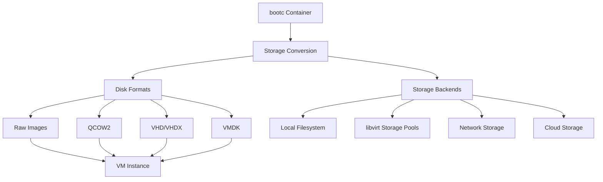

# Storage Management

This guide covers storage management in bcvk, including disk formats, storage backends, performance optimization, and best practices for managing VM storage.

## Storage Architecture Overview

bcvk supports multiple storage backends and formats to accommodate different use cases:



## Disk Image Formats

### Raw Format (.img, .raw)

Raw format provides maximum compatibility and performance:

```bash
# Create raw disk image
bcvk to-disk --format raw --size 30G quay.io/fedora/fedora-bootc:42 /storage/vm.img

# Characteristics
File size: Exactly the specified size (30GB)
Compression: None (full disk allocation)
Performance: Best I/O performance
Compatibility: Universal (all virtualization platforms)
```

**Advantages:**
- Maximum I/O performance
- Universal compatibility
- Simple format, easy to work with
- Direct disk access

**Disadvantages:**
- Large file size (always full allocation)
- No compression
- No advanced features (snapshots, copy-on-write)

### QCOW2 Format (.qcow2)

QEMU's copy-on-write format with advanced features:

```bash
# Create QCOW2 disk image
bcvk to-disk --format qcow2 --size 30G quay.io/fedora/fedora-bootc:42 /storage/vm.qcow2

# Advanced QCOW2 options
bcvk to-disk \
  --format qcow2 \
  --qcow2-compression \
  --qcow2-cluster-size 64k \
  --size 30G \
  quay.io/fedora/fedora-bootc:42 /storage/compressed.qcow2
```

**Advantages:**
- Sparse allocation (only used space allocated)
- Built-in compression
- Snapshot support
- Copy-on-write capabilities
- Backing file support

**Disadvantages:**
- QEMU/KVM specific
- Slight performance overhead
- More complex format

### VHD/VHDX Format

Microsoft Virtual Hard Disk format for Hyper-V and Azure:

```bash
# Create VHD for Azure/Hyper-V
bcvk to-disk --format vhd --size 30G quay.io/fedora/fedora-bootc:42 /storage/azure.vhd

# VHDX for newer Hyper-V
bcvk to-disk --format vhdx --size 127G quay.io/fedora/fedora-bootc:42 /storage/hyperv.vhdx
```

**Use cases:**
- Microsoft Hyper-V virtualization
- Azure cloud deployment
- Windows-based environments

### VMDK Format

VMware Virtual Machine Disk format:

```bash
# Create VMDK for VMware
bcvk to-disk --format vmdk --size 30G quay.io/fedora/fedora-bootc:42 /storage/vmware.vmdk

# VMware-specific optimizations
bcvk to-disk \
  --format vmdk \
  --vmdk-adapter-type lsilogic \
  --vmdk-subformat streamOptimized \
  --size 30G \
  quay.io/fedora/fedora-bootc:42 /storage/vmware-optimized.vmdk
```

**Use cases:**
- VMware vSphere/ESXi
- VMware Workstation/Fusion
- vCloud environments

## Storage Backends

### Local Filesystem Storage

Default storage backend using the local filesystem:

```bash
# Store images on local filesystem
bcvk to-disk quay.io/fedora/fedora-bootc:42 /var/lib/bcvk/fedora.qcow2

# Use specific filesystem for performance
bcvk to-disk quay.io/fedora/fedora-bootc:42 /fast-nvme/storage/fedora.qcow2

# Organize by environment
mkdir -p /storage/{development,staging,production}
bcvk to-disk app:dev /storage/development/app.qcow2
bcvk to-disk app:staging /storage/staging/app.qcow2
bcvk to-disk app:prod /storage/production/app.qcow2
```

### libvirt Storage Pools

Centralized storage management through libvirt:

```bash
# Create storage pool
virsh pool-define-as \
  bootc-storage dir \
  --target /var/lib/libvirt/bootc-images

virsh pool-start bootc-storage
virsh pool-autostart bootc-storage

# Use storage pool with bcvk
bcvk libvirt run \
  --name webapp \
  --storage-pool bootc-storage \
  --disk-size 30G \
  quay.io/fedora/fedora-bootc:42

# List storage pools
virsh pool-list --all

# Check pool usage
virsh pool-info bootc-storage
```

#### Different Storage Pool Types

```bash
# Directory-based pool (default)
virsh pool-define-as dir-pool dir --target /storage/vms

# LVM-based pool
virsh pool-define-as lvm-pool logical --source-dev /dev/sdb --target vg-vms

# NFS-based pool
virsh pool-define-as nfs-pool netfs \
  --source-host nfs.example.com \
  --source-path /exports/vm-storage \
  --target /mnt/nfs-vms

# iSCSI-based pool
virsh pool-define-as iscsi-pool iscsi \
  --source-host iscsi.example.com \
  --source-dev iqn.2023-01.com.example:storage

# Ceph RBD pool
virsh pool-define-as ceph-pool rbd \
  --source-host ceph-mon1.example.com:6789 \
  --source-name vm-pool
```

### Network Storage

#### NFS Storage

```bash
# Mount NFS for VM storage
sudo mkdir -p /mnt/nfs-storage
sudo mount -t nfs nfs.example.com:/exports/vm-storage /mnt/nfs-storage

# Create VMs on NFS
bcvk to-disk quay.io/fedora/fedora-bootc:42 /mnt/nfs-storage/fedora.qcow2

# Configure NFS for performance
mount -t nfs -o vers=4,rsize=1048576,wsize=1048576,hard,intr \
  nfs.example.com:/exports/vm-storage /mnt/nfs-storage
```

#### iSCSI Storage

```bash
# Configure iSCSI initiator
sudo iscsiadm --mode discoverydb \
  --type sendtargets \
  --portal iscsi.example.com \
  --discover

sudo iscsiadm --mode node \
  --targetname iqn.2023-01.com.example:storage \
  --portal iscsi.example.com:3260 \
  --login

# Use iSCSI device for VM storage
bcvk libvirt run \
  --name iscsi-vm \
  --disk /dev/disk/by-path/ip-192.168.1.100:3260-iscsi-iqn.2023-01.com.example:storage-lun-0 \
  quay.io/fedora/fedora-bootc:42
```

### Cloud Storage Integration

#### Amazon S3

```bash
# Upload disk images to S3
aws s3 cp fedora.qcow2 s3://vm-images-bucket/fedora-bootc/

# Download for deployment
aws s3 cp s3://vm-images-bucket/fedora-bootc/fedora.qcow2 ./

# Automated upload after creation
bcvk to-disk quay.io/fedora/fedora-bootc:42 /tmp/fedora.qcow2
aws s3 cp /tmp/fedora.qcow2 s3://vm-images-bucket/latest/
rm /tmp/fedora.qcow2
```

#### Google Cloud Storage

```bash
# Upload to Google Cloud Storage
gsutil cp fedora.qcow2 gs://vm-images-bucket/fedora-bootc/

# Create compute image from storage
gcloud compute images create fedora-bootc-v1 \
  --source-uri gs://vm-images-bucket/fedora-bootc/fedora.qcow2
```

#### Azure Blob Storage

```bash
# Upload to Azure Blob Storage
az storage blob upload \
  --account-name storageaccount \
  --container-name vm-images \
  --name fedora-bootc.vhd \
  --file fedora.vhd

# Create managed disk from blob
az disk create \
  --resource-group myResourceGroup \
  --name fedora-bootc-disk \
  --source https://storageaccount.blob.core.windows.net/vm-images/fedora-bootc.vhd
```

## Storage Performance Optimization

### Filesystem Selection

Choose appropriate filesystems for different use cases:

```bash
# ext4 - Good general purpose
bcvk to-disk --filesystem ext4 quay.io/fedora/fedora-bootc:42 /storage/ext4.img

# XFS - Better for large files and performance
bcvk to-disk --filesystem xfs quay.io/fedora/fedora-bootc:42 /storage/xfs.img

# Btrfs - Advanced features (snapshots, compression)
bcvk to-disk --filesystem btrfs quay.io/fedora/fedora-bootc:42 /storage/btrfs.img
```

### Storage Configuration for Performance

#### High-Performance Configuration

```bash
# High-performance VM with optimized storage
bcvk libvirt run \
  --name high-perf-vm \
  --disk-format raw \
  --disk-cache none \
  --disk-io native \
  --disk-discard unmap \
  --storage-backend nvme \
  quay.io/fedora/fedora-bootc:42

# Use dedicated high-speed storage
bcvk libvirt run \
  --name db-server \
  --disk /fast-nvme/db-server.raw \
  --disk-cache none \
  --memory 16384 \
  database-image
```

#### Cache Policies

Different cache policies for different workloads:

```bash
# writethrough - Safe, moderate performance
bcvk libvirt run --disk-cache writethrough database-image

# writeback - Best performance, less safe
bcvk libvirt run --disk-cache writeback app-image

# none - Direct I/O, best for shared storage
bcvk libvirt run --disk-cache none shared-storage-image

# unsafe - Maximum performance, data loss risk
bcvk libvirt run --disk-cache unsafe test-image
```

### Storage Monitoring and Metrics

#### Monitor Storage Performance

```bash
# Monitor VM disk I/O
virsh domstats --block vmname

# Real-time I/O monitoring
watch -n 1 'virsh domstats --block vmname'

# Host storage performance
iostat -x 1

# Check disk usage
df -h /var/lib/libvirt/images
du -sh /var/lib/libvirt/images/*
```

#### Storage Performance Benchmarking

```bash
# Test disk performance in VM
bcvk libvirt ssh vmname "
  # Sequential write test
  dd if=/dev/zero of=/tmp/test bs=1M count=1000 oflag=direct
  
  # Random I/O test
  fio --name=randwrite --ioengine=libaio --iodepth=16 \
      --rw=randwrite --bs=4k --direct=1 --size=1G \
      --numjobs=1 --runtime=60 --group_reporting
"

# Host-level storage testing
fio --name=test --ioengine=libaio --iodepth=32 \
    --rw=randrw --bs=4k --direct=1 --size=1G \
    --numjobs=4 --runtime=60 --group_reporting \
    --filename=/var/lib/libvirt/images/test.img
```

## Storage Security

### Encryption at Rest

#### LUKS Disk Encryption

```bash
# Create encrypted disk image
bcvk to-disk \
  --encrypt \
  --encryption-format luks \
  --passphrase-file /secure/passphrase.txt \
  quay.io/fedora/fedora-bootc:42 /storage/encrypted.img

# VM with encrypted storage
bcvk libvirt run \
  --name secure-vm \
  --disk-encrypt luks \
  --disk-key-file /secure/vm-key \
  secure-app-image
```

#### File-Level Encryption

```bash
# Encrypt VM image file
gpg --cipher-algo AES256 --compress-algo 1 \
    --symmetric --output fedora.qcow2.gpg fedora.qcow2

# Decrypt for use
gpg --decrypt fedora.qcow2.gpg > fedora.qcow2
```

### Access Control

#### Storage Permissions

```bash
# Set appropriate permissions for VM images
sudo chown qemu:qemu /var/lib/libvirt/images/*.qcow2
sudo chmod 600 /var/lib/libvirt/images/*.qcow2

# SELinux contexts for libvirt
sudo restorecon -R /var/lib/libvirt/images/
sudo setsebool -P virt_use_nfs on  # If using NFS
```

#### Network Storage Security

```bash
# Secure NFS exports
# /etc/exports
/exports/vm-storage 192.168.1.0/24(rw,sync,no_subtree_check,no_root_squash)

# iSCSI authentication
sudo iscsiadm --mode node \
  --targetname iqn.2023-01.com.example:storage \
  --op=update \
  --name node.session.auth.authmethod \
  --value=CHAP

sudo iscsiadm --mode node \
  --targetname iqn.2023-01.com.example:storage \
  --op=update \
  --name node.session.auth.username \
  --value=initiator-username
```

## Storage Backup and Recovery

### VM Backup Strategies

#### Snapshot-Based Backup

```bash
# Create VM snapshot
virsh snapshot-create-as vmname backup-$(date +%Y%m%d-%H%M%S)

# List snapshots
virsh snapshot-list vmname

# Backup with external snapshot
virsh snapshot-create-as vmname backup-external \
  --disk-only \
  --diskspec vda,snapshot=external,file=/backup/vmname-backup.qcow2

# Merge snapshot back
virsh blockcommit vmname vda --active --verbose --pivot
```

#### Image-Level Backup

```bash
# Copy VM disk while running (with snapshot)
virsh snapshot-create-as vmname temp-backup --disk-only
cp /var/lib/libvirt/images/vmname.qcow2 /backup/vmname-$(date +%Y%m%d).qcow2
virsh blockcommit vmname vda --active --verbose --pivot

# Incremental backup
rsync -av --link-dest=/backup/previous/ \
  /var/lib/libvirt/images/ /backup/current/
```

#### Application-Consistent Backup

```bash
#!/bin/bash
# Application-consistent backup script

VM_NAME="database-server"
BACKUP_DIR="/backup/vms"

# Prepare application for backup
bcvk libvirt ssh $VM_NAME "sudo systemctl stop postgresql"
bcvk libvirt ssh $VM_NAME "sync"

# Create snapshot
virsh snapshot-create-as $VM_NAME "backup-$(date +%Y%m%d-%H%M%S)"

# Resume application
bcvk libvirt ssh $VM_NAME "sudo systemctl start postgresql"

# Export snapshot
virsh blockcopy $VM_NAME vda $BACKUP_DIR/$VM_NAME-$(date +%Y%m%d).qcow2 \
  --wait --verbose --transient-job

echo "Backup completed: $BACKUP_DIR/$VM_NAME-$(date +%Y%m%d).qcow2"
```

### Disaster Recovery

#### VM Restore Procedures

```bash
# Restore VM from backup
virsh define vmname-config.xml
virsh start vmname

# Restore from snapshot
virsh snapshot-revert vmname backup-20240115-140000

# Restore from image backup
cp /backup/vmname-20240115.qcow2 /var/lib/libvirt/images/vmname.qcow2
virsh start vmname
```

#### Cross-Site Replication

```bash
#!/bin/bash
# VM replication script

SOURCE_HOST="primary.example.com"
DEST_HOST="backup.example.com"
VM_NAME="critical-app"

# Live migration for replication
virsh migrate --live $VM_NAME qemu+ssh://$DEST_HOST/system

# Storage replication (using rsync)
rsync -av --delete \
  /var/lib/libvirt/images/ \
  $DEST_HOST:/var/lib/libvirt/images/

# Database replication (application-specific)
bcvk libvirt ssh $VM_NAME "
  pg_basebackup -h $SOURCE_HOST -D /backup/postgres -P -W
"
```

## Storage Troubleshooting

### Common Storage Issues

#### Disk Space Problems

```bash
# Check available space
df -h /var/lib/libvirt/images

# Find large files
du -sh /var/lib/libvirt/images/* | sort -rh

# Clean up snapshots
for vm in $(virsh list --all --name); do
  echo "Snapshots for $vm:"
  virsh snapshot-list $vm
done

# Remove old snapshots
virsh snapshot-delete vmname old-snapshot-name
```

#### Performance Issues

```bash
# Check for I/O bottlenecks
iostat -x 1

# Monitor VM disk activity
virsh domstats --block vmname

# Check for storage contention
iotop -a

# Optimize filesystem
# For ext4
tune2fs -o journal_data_writeback /dev/vda1

# For XFS
xfs_fsr /dev/vda1  # Defragment
```

#### Corruption Issues

```bash
# Check filesystem in VM
bcvk libvirt ssh vmname "sudo fsck -f /dev/vda1"

# Check QCOW2 image integrity
qemu-img check /var/lib/libvirt/images/vmname.qcow2

# Repair QCOW2 corruption
qemu-img check -r all /var/lib/libvirt/images/vmname.qcow2

# Recover from backup if needed
cp /backup/vmname-last-good.qcow2 /var/lib/libvirt/images/vmname.qcow2
```

### Storage Debugging

#### Debug Storage Configuration

```bash
# Check libvirt storage configuration
virsh pool-dumpxml default

# Verify VM disk configuration
virsh dumpxml vmname | grep -A 10 disk

# Test storage performance
dd if=/dev/zero of=/var/lib/libvirt/images/test bs=1M count=1000 oflag=direct
rm /var/lib/libvirt/images/test
```

#### Monitor Storage Events

```bash
# Monitor libvirt storage events
virsh event --all --loop

# Monitor kernel storage events
dmesg -w | grep -i "disk\|storage\|i/o"

# Monitor QEMU storage logs
tail -f /var/log/libvirt/qemu/vmname.log
```

## Best Practices

### Storage Planning

1. **Capacity Planning**
   - Monitor storage growth trends
   - Plan for 3x container size minimum
   - Consider snapshot space requirements
   - Account for backup storage needs

2. **Performance Planning**
   - Use SSDs for high-I/O workloads
   - Separate OS and data disks
   - Consider storage RAID configurations
   - Plan network bandwidth for remote storage

3. **Reliability Planning**
   - Implement regular backup schedules
   - Test restore procedures
   - Use redundant storage when possible
   - Monitor storage health metrics

### Security Best Practices

1. **Encryption**: Use disk encryption for sensitive data
2. **Access Control**: Limit access to VM images
3. **Network Security**: Secure network storage protocols
4. **Audit Logging**: Monitor storage access and changes

### Operational Best Practices

1. **Monitoring**: Continuous storage performance monitoring
2. **Maintenance**: Regular filesystem checks and optimization
3. **Documentation**: Document storage configurations and procedures
4. **Testing**: Regular backup and recovery testing

## Next Steps

- Learn about [network configuration](./network-config.md) for VM networking
- Explore [libvirt advanced workflows](./libvirt-advanced.md) for complex storage scenarios
- Understand [architecture details](./architecture.md) for storage implementation
- Review [performance optimization](./performance.md) for storage tuning