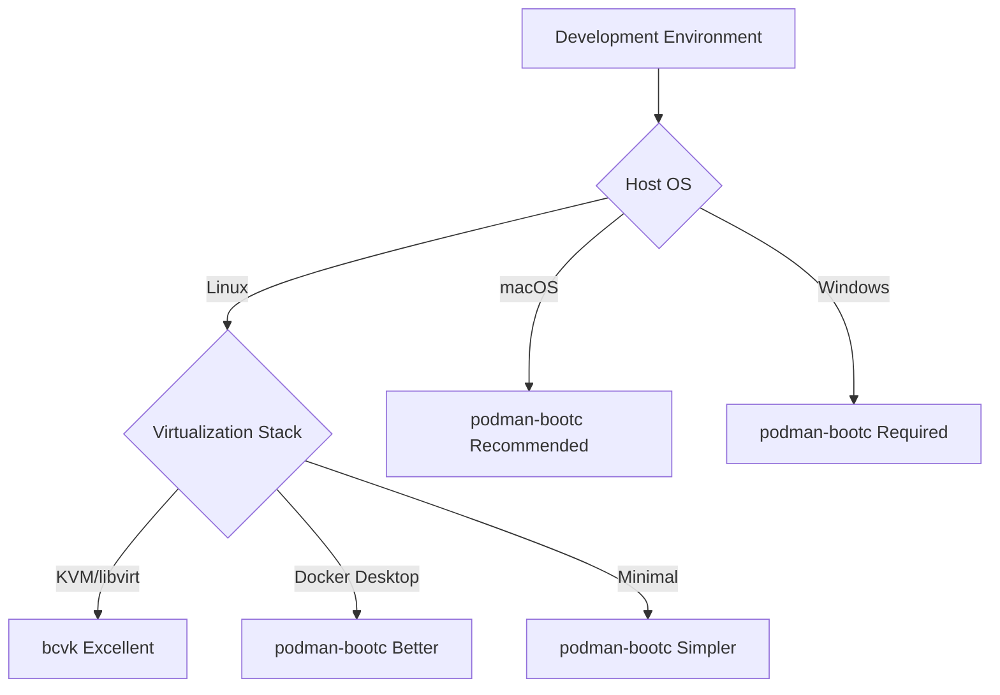
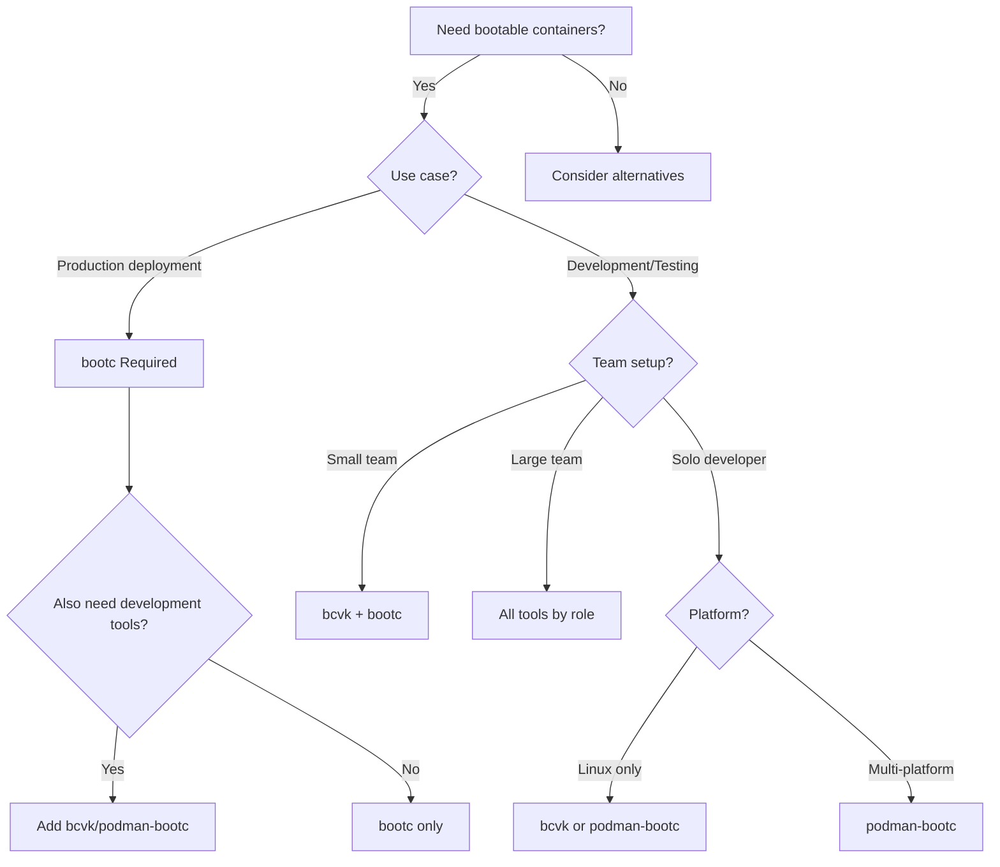

# Tool Selection Guide

Choosing the right tool for your bootable container workflow depends on your specific use case, team structure, and infrastructure requirements. This guide provides a decision framework to help you select the most appropriate tool.

## Decision Matrix

### Use Case Categories

| Use Case | bootc | bcvk | podman-bootc |
|----------|--------|-----------|--------------|
| **Production Deployment** | ✅ Primary | ❌ Not suitable | ❌ Not suitable |
| **Development Testing** | ⚠️ Manual setup | ✅ Optimized | ✅ Streamlined |
| **CI/CD Integration** | ⚠️ Complex | ✅ Flexible | ✅ Standardized |
| **Cross-Platform Development** | ❌ Platform-specific | ⚠️ Linux-focused | ✅ Unified |
| **Performance Testing** | ✅ Native | ✅ Excellent | ⚠️ Good |
| **Learning/Education** | ⚠️ Steep curve | ✅ Accessible | ✅ Simple |

## Team Structure Considerations

### Solo Developer
**Recommended: podman-bootc or bcvk**

- **podman-bootc** if you work across multiple platforms
- **bcvk** if you need performance testing or advanced configurations
- **bootc** only if you're deploying to production

### Small Development Team (2-10 people)
**Recommended: bcvk + bootc**

- Use **bcvk** for development and testing workflows
- Use **bootc** for production deployment and platform work
- Consider **podman-bootc** if team uses mixed operating systems

### Large Enterprise Team
**Recommended: All three tools for different roles**

- **Developer teams**: podman-bootc for consistent cross-platform development
- **Testing teams**: bcvk for comprehensive testing and CI/CD
- **Platform teams**: bootc for production deployment and infrastructure

## Infrastructure Considerations

### Development Environment

### Production Environment
- **Cloud Infrastructure**: bootc with cloud-specific tooling
- **Bare Metal**: bootc for direct hardware installation
- **Edge Computing**: bootc for minimal overhead
- **Container Platforms**: Integration varies by platform

## Workflow Requirements

### Development Velocity Priorities
If rapid iteration is crucial:
1. **podman-bootc** - Minimal setup, quick testing
2. **bcvk** - Automated VM management
3. **bootc** - Manual but complete control

### Testing Depth Requirements
For comprehensive testing needs:
1. **bcvk** - Full VM lifecycle and libvirt integration
2. **podman-bootc** - Good for development testing
3. **bootc** - Complete but manual testing setup

### Production Deployment Complexity
For production deployment:
1. **bootc** - Essential for production deployments
2. **bcvk** - Can generate production-ready disk images
3. **podman-bootc** - Development-focused, not for production

## Technical Requirements

### Performance Sensitivity
- **High performance needs**: bootc (native) or bcvk (KVM)
- **Moderate performance**: Any tool works well
- **Simplicity over performance**: podman-bootc

### Network Configuration Complexity
- **Advanced networking**: bcvk with libvirt
- **Standard networking**: Any tool
- **Cross-platform consistency**: podman-bootc

### Storage Requirements
- **Custom storage layouts**: bootc
- **Standard configurations**: bcvk or podman-bootc
- **Cross-platform storage**: podman-bootc

## Migration Paths

### Starting Simple

**Progression path for growing complexity**:
1. Start with **podman-bootc** for learning and simple development
2. Move to **bcvk** as testing and performance needs grow
3. Add **bootc** when production deployment is required

### Platform-Specific Recommendations

#### Linux-First Organizations
- **Primary**: bcvk for development, bootc for production
- **Secondary**: podman-bootc for onboarding new developers

#### Multi-Platform Organizations  
- **Primary**: podman-bootc for development consistency
- **Secondary**: bcvk for Linux-based testing and production prep

#### Cloud-Native Organizations
- **Development**: podman-bootc or bcvk based on team preference
- **Production**: bootc with cloud-specific automation

## Decision Flowchart

## Getting Started Recommendations

### Week 1: Learn the Concepts
- Start with **podman-bootc** for hands-on learning
- Read bootc documentation to understand fundamentals
- Experiment with simple container-to-VM workflows

### Week 2: Expand Capabilities  
- Try **bcvk** for more advanced VM management
- Compare performance and features between tools
- Identify which tool fits your primary use case

### Week 3: Production Planning
- Learn **bootc** for production deployment scenarios
- Plan your tool combination for different workflow stages
- Set up CI/CD integration with your chosen tools

## Best Practices

### Tool Combination Strategies
- **Use multiple tools** for different stages of your workflow
- **Standardize within teams** but allow flexibility across teams
- **Document your tool choices** and the reasoning behind them

### Avoiding Common Pitfalls
- Don't use development tools for production deployment
- Don't over-engineer simple development workflows
- Don't ignore cross-platform requirements in diverse teams

The goal is to build effective workflows that match your team's needs and infrastructure while maintaining a clear path from development to production.