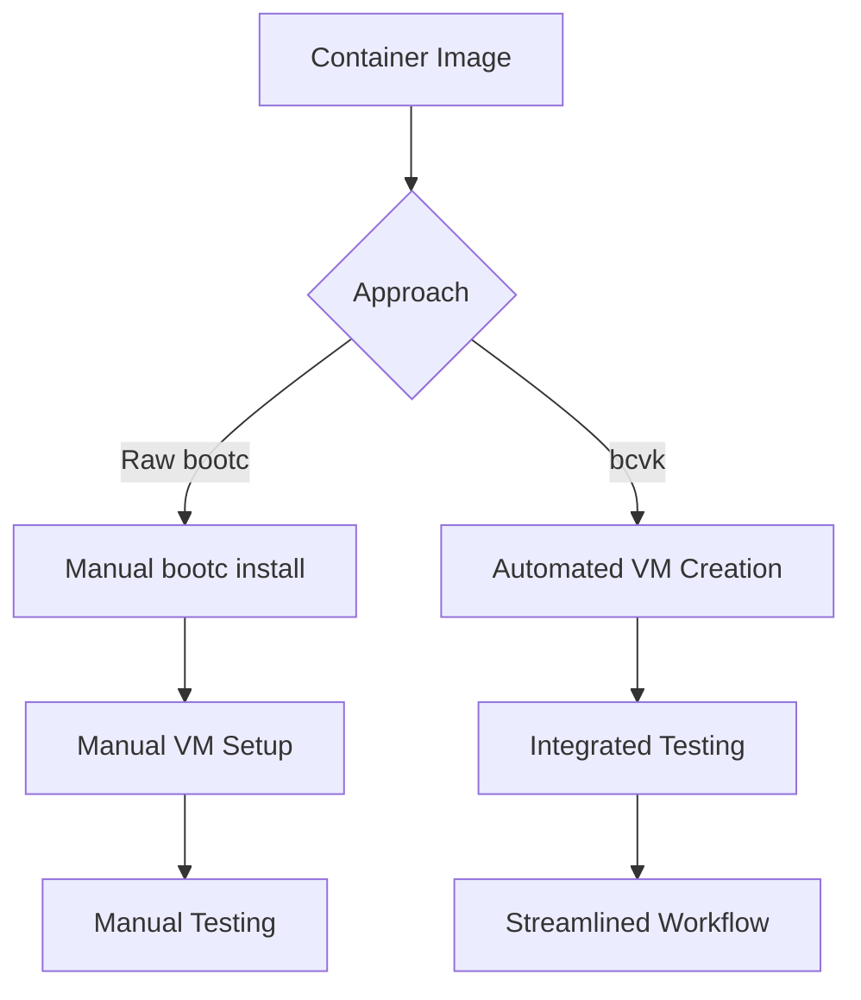

# bcvk vs Raw bootc

While bootc is the foundational tool for building and managing bootable containers, bcvk provides a higher-level abstraction focused on virtualization workflows. Understanding when to use each approach is essential for effective bootable container development.

## Fundamental Differences

### Scope and Purpose
- **bootc**: Core functionality for building, installing, and managing bootable container systems
- **bcvk**: Specialized toolkit that leverages bootc for virtualization-focused workflows

### Abstraction Level
- **bootc**: Low-level control over bootable container lifecycle and installation
- **bcvk**: High-level workflows that abstract away virtualization complexity

### Target Users
- **bootc**: System administrators, platform engineers, and advanced users who need direct control
- **bcvk**: Developers and teams who want streamlined virtualization workflows

## Workflow Comparison

### Image Creation and Testing

### Installation Workflows
- **Raw bootc**: Direct control over installation targets, filesystem layouts, and boot configuration
- **bcvk**: Automated installation into VM environments with sensible defaults

### Testing and Development
- **Raw bootc**: Manual VM creation and management for testing changes
- **bcvk**: Automated VM lifecycle management with integrated SSH access

## When to Use Raw bootc

### Production Deployments
Raw bootc is essential for production deployments where you need:
- **Direct hardware installation** onto bare metal servers
- **Custom partition layouts** and filesystem configurations  
- **Integration with existing infrastructure** management tools
- **Precise control** over boot processes and system configuration

### Platform Development
When building bootable container platforms:
- **Custom bootloader configurations** for specific hardware
- **Specialized installation targets** beyond standard VM formats
- **Integration with hardware provisioning** systems
- **Development of bootc extensions** and plugins

### Edge Computing
For edge deployments requiring:
- **Minimal resource overhead** without virtualization layers
- **Direct hardware access** for performance-critical applications
- **Custom update mechanisms** integrated with edge management platforms
- **Specialized boot configurations** for embedded systems

## When to Use bcvk

### Development Workflows
bcvk excels in development scenarios:
- **Rapid iteration** on bootable container changes
- **Automated testing** of container modifications
- **Consistent development environments** across team members
- **Integration testing** without manual VM management

### CI/CD Pipelines  
For automated testing and validation:
- **Automated VM provisioning** for test environments
- **Parallel testing** across multiple configurations
- **Integration with container registries** and build systems
- **Standardized testing workflows** that can be shared across projects

### Prototyping and Experimentation
When exploring bootable container concepts:
- **Quick experimentation** with different container configurations
- **Learning bootable containers** without complex virtualization setup
- **Proof-of-concept development** before production implementation
- **Educational environments** for teaching bootable container concepts

## Complementary Usage Patterns

### Development to Production Pipeline
Many organizations use both tools in sequence:

1. **Development Phase**: Use bcvk for rapid iteration and testing
2. **Validation Phase**: Use bcvk for automated testing and CI/CD
3. **Production Phase**: Use raw bootc for deployment to target infrastructure

### Hybrid Workflows
Teams often maintain parallel workflows:
- **bcvk**: For development team velocity and testing automation
- **Raw bootc**: For platform engineering and production operations

## Technical Capabilities

### Installation Targets
- **Raw bootc**: Any supported target (disk images, physical devices, cloud instances)
- **bcvk**: Focused on VM targets with optimized workflows

### Configuration Flexibility
- **Raw bootc**: Complete control over all aspects of installation and configuration
- **bcvk**: Streamlined configuration focused on development and testing needs

### Integration Points
- **Raw bootc**: Direct integration with system management tools and infrastructure
- **bcvk**: Integration with development tools, CI/CD systems, and virtualization platforms

## Migration and Transition

### From bcvk to Production
Moving from development with bcvk to production with raw bootc:
- **Configuration translation** from VM-optimized to production settings
- **Testing validation** ensuring parity between environments  
- **Deployment automation** adapting bcvk workflows to production tooling

### Learning Path
For teams new to bootable containers:
1. **Start with bcvk** for rapid learning and experimentation
2. **Understand underlying bootc** concepts through bcvk usage
3. **Transition to raw bootc** as production requirements become clear

## Decision Criteria

Choose **raw bootc** when:
- Deploying to production infrastructure
- Need precise control over installation and configuration
- Working with specialized hardware or edge devices
- Building platform-level tooling

Choose **bcvk** when:
- Developing and testing bootable containers
- Need rapid iteration and automation
- Working in virtualized development environments
- Building CI/CD workflows for bootable containers

The two tools are designed to work together, with bcvk providing development velocity while raw bootc enables production deployment capabilities.