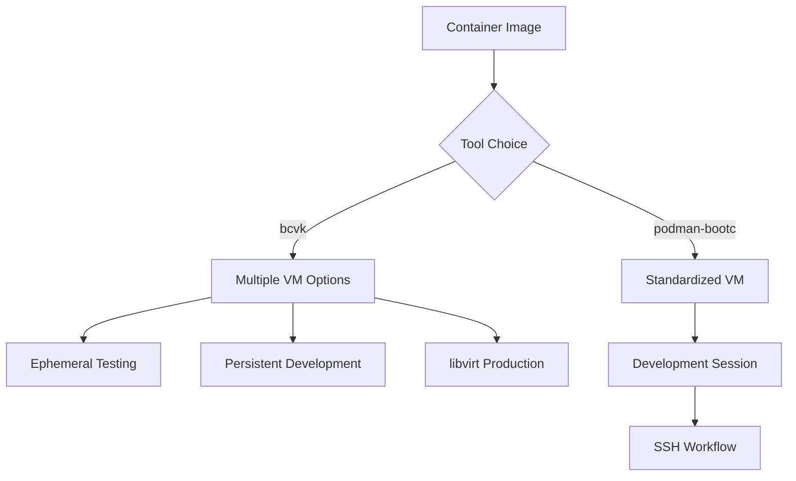

# bcvk vs podman-bootc

Both bcvk (bcvk) and podman-bootc solve similar problems but with different architectural approaches and design philosophies. Understanding these differences helps you choose the right tool for your workflow.

## Architectural Differences

### Container Runtime Integration
- **bcvk**: Works with any container runtime and doesn't require specific Podman configurations
- **podman-bootc**: Tightly integrated with Podman and requires rootful Podman Machine setup

### Platform Support Strategy
- **bcvk**: Native virtualization on each platform (KVM on Linux, direct QEMU integration)
- **podman-bootc**: Unified approach through Podman Machine abstraction layer

### VM Management Philosophy
- **bcvk**: Flexible VM management with both ephemeral and persistent options
- **podman-bootc**: Focused on development workflows with automatic lifecycle management

## Workflow Differences

### Development Iteration

### Cross-Platform Development
- **bcvk**: Platform-native virtualization for optimal performance
- **podman-bootc**: Consistent experience across Linux and macOS through Podman Machine

### Resource Management
- **bcvk**: Fine-grained control over VM resources and configuration
- **podman-bootc**: Simplified resource management with sensible defaults

## Use Case Strengths

### bcvk Excels At:
- **Production-like testing** with full libvirt integration
- **Performance-sensitive workloads** with native virtualization
- **Complex networking scenarios** requiring advanced configuration
- **Mixed virtualization environments** where you need multiple VM types
- **CI/CD integration** where you need precise control over VM lifecycle

### podman-bootc Excels At:
- **Cross-platform development teams** with mixed Linux/macOS environments
- **Rapid prototyping** with minimal setup requirements
- **Podman-centric workflows** where container and VM management are unified
- **Simplified onboarding** for developers new to bootable containers
- **Consistent development environments** across different host platforms

## Integration Patterns

### Container Registry Workflow
Both tools integrate with container registries but with different approaches:

- **bcvk**: Direct integration with any OCI-compatible registry
- **podman-bootc**: Leverages Podman's registry integration and caching

### CI/CD Integration
- **bcvk**: Designed for flexible CI/CD integration with customizable VM configurations
- **podman-bootc**: Optimized for Podman-based CI systems and GitHub Actions workflows

### Team Collaboration
- **bcvk**: Supports diverse team setups with flexible VM sharing options
- **podman-bootc**: Standardized development environments reduce "works on my machine" issues

## Migration Considerations

### From podman-bootc to bcvk
- More configuration flexibility but requires understanding of virtualization concepts
- Better performance for compute-intensive testing
- Access to advanced libvirt features

### From bcvk to podman-bootc  
- Simplified setup and management
- Consistent cross-platform experience
- Tighter integration with Podman workflows

## Complementary Usage

Many teams use both tools for different purposes:

- **bcvk** for production testing and performance validation
- **podman-bootc** for daily development and quick testing

This hybrid approach leverages the strengths of each tool while minimizing their individual limitations.

## Decision Framework

Choose **bcvk** when:
- You need production-grade VM testing capabilities
- Performance and resource control are critical
- You're working in Linux-centric environments
- You need advanced networking or storage configurations

Choose **podman-bootc** when:
- You're working in mixed OS environments
- You want minimal setup complexity
- Your team is already using Podman extensively
- You prioritize consistent development experiences

Both tools continue to evolve, and the choice often comes down to your specific infrastructure, team preferences, and workflow requirements.